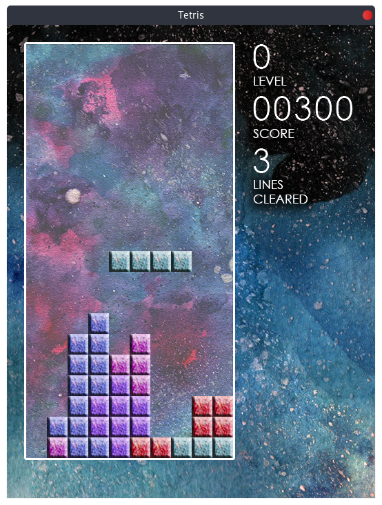

# tetris-sfml

Small, open-source Tetris clone written in C++ with SFML library.



## Features
- background and block tiles textures painted by Julia Rozworska,
- scoring system based on the original BPS version system,
- level and cleared lines display

## Usage
### Controls
Move tetrominoes with ⬅️ and ➡️
Make them fall faster by holding ⬇️
Pause the game by pressing 🅿️

### Building
SFML libraries need to be installed and configured in g++ compiler. Refer to [SFML documentation](https://www.sfml-dev.org/tutorials/2.5/) for detailed instructions.

To build an executable, clone the repo and run `make`:

```
git checkout http://github.com/k0mmsussert0d/tetris-sfml/
cd tetris-sfml/src/
make
```

### Running
Executable will be built in `tetris-sfml/src` directory. Run it with:
```
./tetris
```

## License
This software, including source code and artistic works is released under [GNU General Public License version 3](https://opensource.org/licenses/GPL-3.0).
